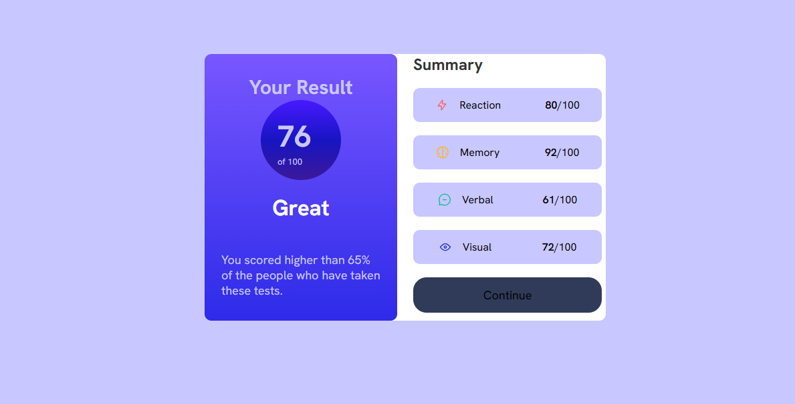

# Frontend Mentor - Results summary component solution

This is a solution to the [Results summary component challenge on Frontend Mentor](https://www.frontendmentor.io/challenges/results-summary-component-CE_K6s0maV). Frontend Mentor challenges help you improve your coding skills by building realistic projects. 

## Live Demo: [Vercel](https://result-summary-delta-gilt.vercel.app/)

## Table of contents

- [Overview](#overview)
  - [The challenge](#the-challenge)
  - [Screenshot](#screenshot)
  - [Links](#links)
- [My process](#my-process)
  - [Built with](#built-with)
  - [What I learned](#what-i-learned)


## Overview

##

### Screenshot




### Links

- Live Demo: [Vercel](https://result-summary-delta-gilt.vercel.app/)

## My process

### Built with

- Semantic HTML5 markup
- CSS custom properties
- Flexbox
- CSS Grid
- Mobile-first workflow


### What I learned


```html
<h1>Some HTML code I'm proud of</h1>

<div class="left-content">
          <div class="reaction element-1">
            <div class="left-reaction">
              
              <p>Reaction</p>
            </div>
            <div class="right-reaction">
              <p><span>80</span>/100</p>
            </div>
          </div>

```
```css

.right{
    background: linear-gradient(to bottom, 
  hsl(252, 100%, 67%), 
  hsl(241, 81%, 54%));
```


## Author

- Website - [Brian Mwangi]


## Thanks for visiting


